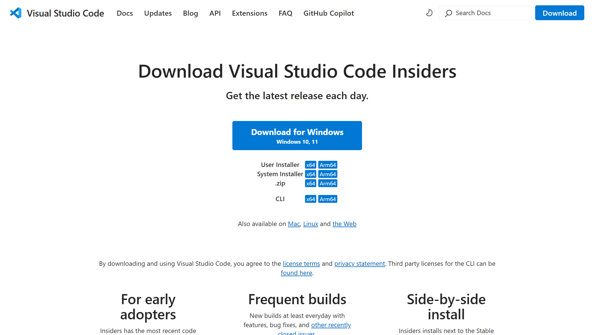
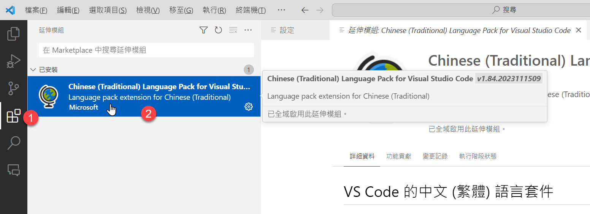
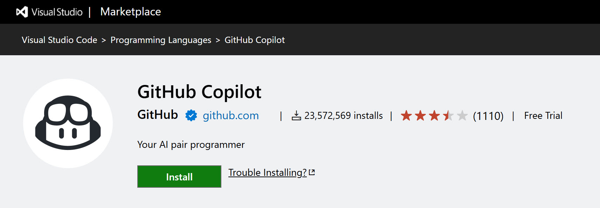
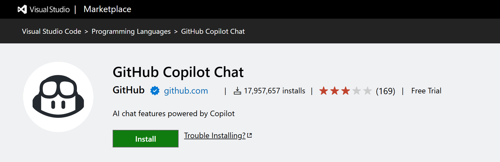
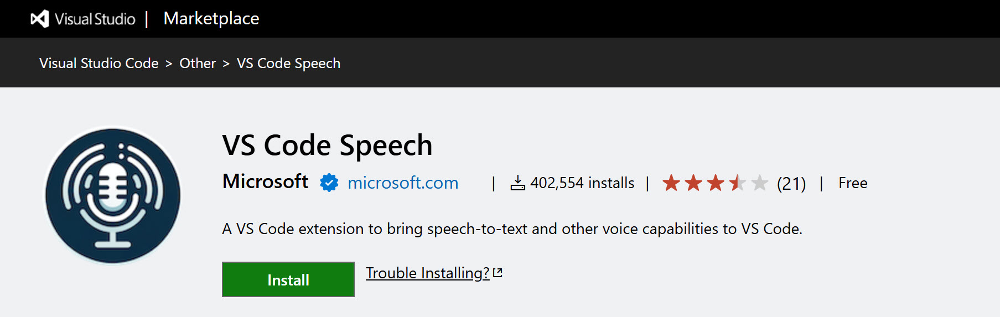
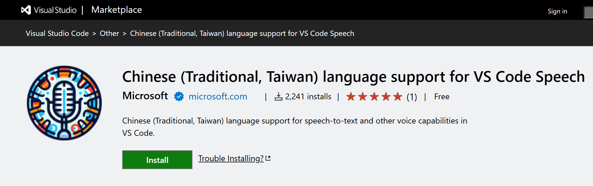
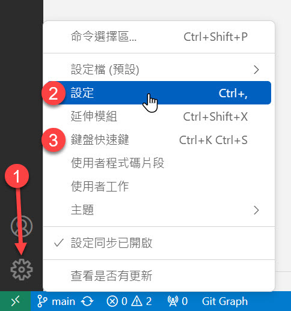
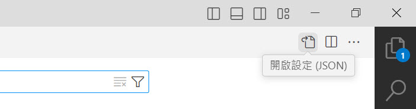
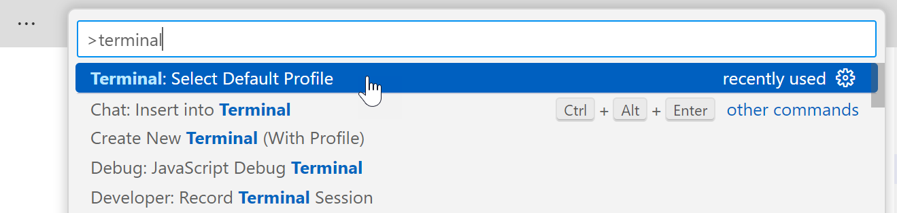
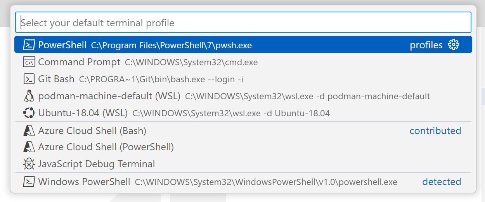

# 最佳 GitHub Copilot 設定

大家好，我是 Will 保哥，我之前開了三堂關於 GitHub Copilot 的課程，為了這些課程，我精心準備了許多 GitHub Copilot 的應用技巧。為了更好的應用這些 GitHub Copilot 這個好用工具，我測試了幾乎所有 GitHub Copilot 的選項設定，這個 Repo 就是用來整理我認為的 GitHub Copilot **最佳設定**，讓學員們能夠在課程中更輕鬆的使用 GitHub Copilot！👍

由於課程內容非常豐富，如果沒有報名過我的課程，強烈建議大家可以購買課程的錄影回放，這樣就能夠更深入的了解 GitHub Copilot 的使用方式與技巧。

1. 入門課：適合從未使用過 GitHub Copilot 的新手

    [GitHub Copilot 協作開發實戰](https://learn.duotify.com/courses/gh-copilot)

2. 進階課：適合有一定基礎的開發者

    [GitHub Copilot 進階開發實戰](https://learn.duotify.com/courses/gh-copilot-pro)

3. 代理人：適合希望深入了解 Agent Mode 的 GitHub Copilot 開發人員

    [全面掌握 GitHub Copilot 代理人模式：打造專屬 AI 開發助手](https://learn.duotify.com/courses/gh-copilot-agent)

如果你不知道自己適合哪一堂課，我的建議一律是都買回去看就對了，因為這三堂課的內容是相輔相成的，內容很少有重疊，這樣你就能夠更深入的了解 GitHub Copilot 的使用方式與技巧。

1. [GitHub Copilot 完整課程 (共三堂)](https://learn.duotify.com/courses/gh-copilot-all)

2. [GitHub Copilot 入門到進階 (共二堂)](https://learn.duotify.com/courses/gh-copilot-beginner)

    如果你只有報名過 [全面掌握 GitHub Copilot 代理人模式：打造專屬 AI 開發助手](https://learn.duotify.com/courses/gh-copilot-agent) 這堂課，想要補充我的前兩堂課程的話，可以購買這個組合票。

## 安裝 GitHub 支援的開發工具

目前 GitHub Copilot 的 `Agent Mode` 已在 [Visual Studio Code](https://code.visualstudio.com/) `v1.99` 之後的版本提供。

我個人還是建議安裝 [Visual Studio Code Insiders](https://code.visualstudio.com/insiders/) 開發工具，因為有些功能可能僅在 Insiders 版本中可用，並且會隨著新功能的發布而更新。



## 切換 Visual Studio Code 顯示語言為繁體中文

Visual Studio Code 是一套跨平台的編輯器，支援 Windows、macOS 與 Linux，因此理論上所有人都可以順利安裝與使用，如果你真的有遇到什麼困難，歡迎隨時到 Discord 課程專屬頻道中發問。

由於 Visual Studio Code 是一套輕量級的編輯器，它的功能是透過安裝「擴充套件」來增強的。

首先，Visual Studio Code 支援完整的「繁體中文」介面，而且翻譯品質非常好，在首次安裝並啟動 Visual Studio Code 後，該軟體就會提醒你安裝繁體中文套件，建議英文不太好的朋友可以安裝繁體中文版。



如果你的介面沒有自動切換到繁體中文版，那就請透過以下步驟手動切換：

1. 按下 `F1` 並輸入 `>display language` 並選擇 `Configure Display Language`

    

2. 選擇 `中文(繁體) (zh-tw)` 並按下 `Enter` 鍵

    

3. 按下 `Restart` 按鈕以重新啟動 Visual Studio Code

    

## 安裝 Visual Studio Code 擴充套件

GitHub Copilot 的功能是透過安裝**擴充套件**來實現的，你需要安裝以下擴充套件才能順利的使用 GitHub Copilot 工具：

1. [GitHub Copilot](https://marketplace.visualstudio.com/items?itemName=GitHub.copilot)

    

2. [GitHub Copilot Chat](https://marketplace.visualstudio.com/items?itemName=GitHub.copilot-chat)

    

3. [VS Code Speech](https://marketplace.visualstudio.com/items?itemName=ms-vscode.vscode-speech)

    

4. [Chinese (Traditional, Taiwan) language support for VS Code Speech](https://marketplace.visualstudio.com/items?itemName=ms-vscode.vscode-speech-language-pack-zh-tw)

    

5. [Live Preview](https://marketplace.visualstudio.com/items?itemName=ms-vscode.live-server)

    可以讓你在 Visual Studio Code 裡面的檔案隨時都能透過瀏覽器預覽網頁。

## GitHub Copilot 在 Visual Studio Code 的建議設定

以下是我在精雕細琢之後，覺得最完美的 [GitHub Copilot Chat](https://marketplace.visualstudio.com/items?itemName=GitHub.copilot-chat) 與 [VS Code Speech](https://marketplace.visualstudio.com/items?itemName=ms-vscode.vscode-speech) 設定參數，可以讓你在使用 GitHub Copilot 時更加順暢，也可以讓你在使用語音輸入時更加自然舒適。

請先找到 Visual Studio Code 的左下角或右下角的 `⚙` 圖示，點開之後選擇 `設定` 與 `鍵盤快速鍵` 這兩項，依據以下說明調整設定。



你也可以打開 `設定` 與 `鍵盤快速鍵` 後，找到右上角的 **開啟設定(JSON)** 按鈕，你就可以開啟相對應的 `settings.json` 或 `keybindings.json` 檔案，直接合併我在下方整理的 JSON 設定也可以，這是最快速的設定方法。



💡 以下兩個檔案我已經整理在 Repo 之中，可以直接下載回去使用：

1. [.vscode/settings.json](.vscode/settings.json)
2. [.vscode/keybindings.json](.vscode/keybindings.json)

以下則是我對每一個設定選項的摘要說明：

1. 使用者設定

    * **GitHub Copilot - 一般設定**

      * `github.copilot.enable`

        設定在**所有檔案**啟用 GitHub Copilot 功能，但停用「**純文字**」檔案類型。

      * `github.copilot.selectedCompletionModel` (可選設定)

        GitHub Copilot 目前預設自動補全的模型已經是 `gpt-4o-copilot`，相較於過去的 `copilot-codex` (GPT-3.5 Turbo) 來說更加聰明。此設定現在通常不需要手動調整，除非你想要切換到其他可用的模型。
        
        > 你也可以用 `F1` > `GitHub Copilot: Change Completion Model` 選擇。

      * `github.copilot.editor.enableCodeActions` 設定為 `true`

        控制 Copilot 命令在可用時是否顯示為 **Code Actions** (程式碼動作)

      * `github.copilot.renameSuggestions.triggerAutomatically` 設定為 `true`

        自動觸發重新命名建議

      * `window.commandCenter` 設定為 `true`

        如果要啟用 `chat.commandCenter.enabled` 設定，就必須啟用這個設定。

      * `chat.commandCenter.enabled` 設定為 `true`

        設定要不要在編輯器中啟用 Copilot Chat 指令中心按鈕。

      * `workbench.commandPalette.experimental.askChatLocation` 設定為 `chatView`

        當你按下 `F1` 之後詢問 `Ask GitHub Copilot` 的結果要顯示在哪裡，選 `chatView` 就會留下提問記錄，若選 `quickChat` 就不會留下。

      * `github.copilot.chat.search.semanticTextResults` 設定為 `true`

        在**搜尋檢視**中啟用**語意搜尋結果**。

      * `github.copilot.nextEditSuggestions.enabled` 設定為 `true` (預覽功能)

        在編輯器中啟用**下一個編輯建議**(NES)功能。

        > NES = Next Edit Suggestions

      * `editor.inlineSuggest.edits.showCollapsed` 設定為 `true`

        在啟用**下一個編輯建議**(NES)功能之後，編輯器會經常提醒你要不要按下 Tab 貼上建議的程式碼。但是預設這些建議都會直接在編輯器上占空間，有時候非常干擾我們的開發心流，所以我個人建議將這個設定調整為 `true`，他就不會一直跳出來顯示你要按下 Tab 會被加入的內容了。

    * **GitHub Copilot Chat**

      * `github.copilot.chat.followUps` 設定為 `firstOnly` 或 `always`

        是否要在聊天中建議跟進訊息，提供你**下一個提示**的建議。

      * `github.copilot.chat.localeOverride` 設定為 `zh-TW`

        設定 GitHub Copilot Chat 的回應語言預設為**繁體中文**

      * `github.copilot.chat.useProjectTemplates` 設定為 `true`

        使用 `/new` 時直接選用 GitHub 專案範本

      * `github.copilot.chat.scopeSelection` 設定為 `true`

        如果使用者使用 `/explain` 並且使用中編輯器沒有選取，是否提示使用者選取特定符號範圍。

      * `chat.detectParticipant.enabled` 設定為 `false`

        在 Chat View 聊天的時候自動偵測適合的**聊天參與者**來執行你的需求，因此你可以不用特別透過 `@` 叫用聊天參與者。

        如果設定為 `true` 的話，如果呼喚出錯誤的**聊天參與者**，可以按下 `rerun without` 重跑一次，這時就會交給 Copilot 來回答。([說明](https://code.visualstudio.com/updates/v1_93#_automatic-chat-participant-detection-in-chat-view-experimental))

        依照我的過往經驗，設定為 `true` 的時候，經常會叫錯**聊天參與者**，所以我個人是建議將該設定調整為 `false` 比較好。

      * `chat.promptFiles` 設定為 `true` (實驗性功能)

        啟用提示檔案(prompts)功能，讓您可以在 VS Code 建立可分享、可重複使用的提示指令，並附加額外的上下文。

        可運用在 Chat View, Edit View, Agent Mode, Inline Chat 等環境下。

        詳見 [Reusable prompt files (experimental)](https://code.visualstudio.com/docs/copilot/copilot-customization#_reusable-prompt-files-experimental)

      * `chat.promptFilesLocations` 設定指定多個 prompt 檔案資料夾 (實驗性功能)

        可指定多個 prompt 檔案資料夾位置，讓您能夠組織和管理不同類型的提示檔案。

        ```json
        "chat.promptFilesLocations": {
            ".github/personal": true
        },
        ```

        注意：`.github/prompts` 資料夾已預設包含，無需額外設定。

        建議搭配 `.gitignore` 檔案排除個人化的 prompt 資料夾（如 `.github/personal`），避免將個人提示檔案提交到版本控制系統中。

        詳見 [Prompt files (experimental) settings](https://code.visualstudio.com/docs/copilot/copilot-customization#_prompt-files-experimental-settings)

      * `github.copilot.chat.languageContext.typescript.enabled` 設定為 `true` (實驗性功能)

        在 Inline Chat 與 Inline Completion 啟用自動向 TypeScript Language Service 取用 Context 資訊的能力，以獲取更多附加額外的上下文。

      * `github.copilot.chat.agent.thinkingTool` 設定為 `true`

        啟用這個思考工具設定，能讓 Copilot 能夠在代理模式下深入思考您的請求，然後再生成回應。

    * **GitHub Copilot Chat - 內嵌聊天 (Inline Chat)**

      * `github.copilot.chat.editor.temporalContext.enabled` 設定為 `true`

        是否要在 Copilot 要求中包含最近檢視及編輯過的檔案。

      * `inlineChat.holdToSpeech` 設定為 `true`

        按住不放 `Ctrl+U` 或 `Ctrl+I` 開始語音對話

      * `inlineChat.finishOnType` 設定為 `false`

        在編輯器中輸入時，不會自動結束 Inline Chat 對話

    * **GitHub Copilot Chat - 偵錯相關設定**

      * `github.copilot.chat.startDebugging.enabled` 設定為 `true`

        在 Chat View 啟用實驗性的 `/startDebugging` 命令，幫你快速在 VS Code 初始化偵錯相關設定。

    * **GitHub Copilot Chat - 測試相關設定**

      * `github.copilot.chat.setupTests.enabled` 設定為 `true`

        啟用實驗性的 `/setupTests` 命令，幫你在 VS Code 快速初始化單元測試相關設定。

      * `github.copilot.chat.generateTests.codeLens` 設定為 `true` (實驗性功能)

        讓你在編輯器中遇到某一個函式或方法沒有涵蓋到測試範圍時，自動產生 `Generate tests` 的 Code lens 建議。

      * `github.copilot.chat.testGeneration.instructions` 設定為以下內容：

        ```json
        "github.copilot.chat.testGeneration.instructions": [
          {
            "file": ".copilot-test-instructions.md"
          },
          {
            "text": "Always try uniting related tests in a suite."
          }
        ],
        ```

    * **GitHub Copilot Chat - 自訂提示**

      * `github.copilot.chat.codeGeneration.useInstructionFiles` 設定為 `true`

        使用 `.github/copilot-instructions.md` 文件來自訂程式碼生成邏輯

      * `github.copilot.chat.codeGeneration.instructions` 設定為以下內容：

        ```json
        "github.copilot.chat.codeGeneration.instructions": [
          {
            "text": "Always response in #zh-tw."
          },
          {
            "text": "When outputing any text, use the following translation mappings: create = 建立, object = 物件, queue = 佇列, stack = 堆疊, information = 資訊, invocation = 呼叫, code = 程式碼, running = 執行, library = 函式庫, schematics = 原理圖, building = 建構, Setting up = 設定, package = 套件, video = 影片, for loop = for 迴圈, class = 類別, Concurrency = 平行處理, Transaction = 交易, Transactional = 交易式, Code Snippet = 程式碼片段, Code Generation = 程式碼產生器, Any Class = 任意類別, Scalability = 延展性, Dependency Package = 相依套件, Dependency Injection = 相依性注入, Reserved Keywords = 保留字, Metadata =  Metadata, Clone = 複製, Memory = 記憶體, Built-in = 內建, Global = 全域, Compatibility = 相容性, Function = 函式, Refresh = 重新整理, document = 文件, example = 範例, demo = 展示, quality = 品質, tutorial = 指南, recipes = 秘訣, byte = 位元組, bit = 位元"
          },
          {
              "file": ".copilot-instructions.md"
          }
        ],
        ```

      * `github.copilot.chat.reviewSelection.instructions` 設定為以下內容：

        ```json
        "github.copilot.chat.reviewSelection.instructions": [
            {
                "file": ".copilot-review-instructions.md"
            }
        ],
        ```

      * `github.copilot.chat.commitMessageGeneration.instructions` 設定為以下內容：

        ```json
        "github.copilot.chat.commitMessageGeneration.instructions": [
          {
            "file": ".copilot-commit-message-instructions.md"
          }
        ],
        ```

      * `github.copilot.chat.pullRequestDescriptionGeneration.instructions` 設定為以下內容：

        ```json
        "github.copilot.chat.pullRequestDescriptionGeneration.instructions": [
          {
            "file": ".copilot-pull-request-description-instructions.md"
          }
        ],
        ```

    * **GitHub Copilot Edit**

      * `github.copilot.chat.edits.suggestRelatedFilesForTests` 設定為 `true`

        該功能會在你編輯程式碼時，建議與測試相關的檔案。這對於開發者來說非常有用，因為它可以幫助你快速找到並編輯與當前程式碼變更相關的測試檔案，從而確保程式碼的品質和可靠性。

      * `github.copilot.chat.edits.suggestRelatedFilesFromGitHistory` 設定為 `true`

        該功能會根據 Git 歷史紀錄來建議相關的檔案。這意味著當你編輯某個檔案時，GitHub Copilot Chat 會根據過去的 Git 提交紀錄，建議可能與當前編輯相關的其他檔案。這有助於你更全面地理解程式碼變更的影響範圍，並確保所有相關檔案都得到了適當的更新。

      * `chat.editing.confirmEditRequestRemoval` 設定為 `true`

        該功能會在你嘗試刪除由 GitHub Copilot Chat 生成的程式碼變更時，提示你確認是否要刪除。這樣可以避免意外刪除程式碼變更，並確保你的程式碼變更是正確的。

      * `chat.editing.confirmEditRequestRetry` 設定為 `true`

        該功能會在你嘗試重新生成由 GitHub Copilot Chat 生成的程式碼變更時，提示你確認是否要重新生成。這樣可以避免意外重新生成程式碼變更，並確保你的程式碼變更是正確的。

    * **GitHub Copilot Chat - Agent Mode**

      * `chat.agent.enabled` 設定為 `true`

        即便是 Visual Studio Code Insiders 版本，預設 Agent Mode 也是沒有啟用的，你必須手動啟用這個選項，才可以看見 Copilot Edit 中的功能。

      * `chat.agent.maxRequests` 設定為 `100`

        預設 Agent Mode 在讓 Agent 自動作業的時候，預設只有 `15` 次迭代，對於一些比較複雜的工作，可能會需要你不斷的確認是否繼續。建議可以調高到 `100`，避免有時候量比較多就超標了。100 要超標就很有難度了。

      * `github.copilot.chat.codesearch.enabled` 設定為 `true` (預覽功能)

        這個選項用來啟用 `#codebase` 變數的「代理人」原始碼搜尋功能。

        傳統**一般搜尋**主要是透過**關鍵字比對**，搭配 `github.copilot.chat.search.semanticTextResults` 設定為 `true` 可以啟用搜尋時做**語意比對**，但在 GitHub Copilot Chat 聊天時，如果要透過 `#codebase` 變數找檔案，之前就只能做一次性的比對。

        當啟用了 `github.copilot.chat.codesearch.enabled` 設定後，就不會只搜尋一次，而是會多嘗試幾種不同的搜尋條件，幫你更好的找到需要的程式碼！👍

      * `github.copilot.chat.newWorkspaceCreation.enabled` 設定為 `true` (實驗性功能)

        這個選項用來啟用 `@workspace /new` 建立新專案的「代理人」功能。

      * `github.copilot.chat.agent.runTasks` 設定為 `true`

        這個選項感覺跟 Agent Mode 相關，實則完全無關。其設定值預設也為 `true`，所以理論上不用特別設定。

        這個選項的用途，主要是讓你可以在 GitHub Copilot Chat 呼叫 `.vscode/tasks.json` 定義的 Task 來執行。

      * `chat.mcp.enabled` 設定為 `true`

        啟用 GitHub Copilot 的 MCP (Model Context Protocol) 支援。

      * `chat.mcp.discovery.enabled` 設定為以下 JSON 內容，預設關閉其他 MCP Host 的伺服器註冊資訊：

        ```json
        "chat.mcp.discovery.enabled": {
            "claude-desktop": false,
            "windsurf": false,
            "cursor-global": false,
            "cursor-workspace": false
        }
        ```

      * `mcp` 用來註冊 MCP 伺服器的啟動資訊：

        ```json
        "mcp": {
          "servers": {
          }
        },
        ```

      * `telemetry.telemetryLevel` 設定為 `off`

        設定此選項可以避免 Agent Mode 無法啟用的問題。請注意，在更改此設定後，您需要重新啟動 Visual Studio Code 以使更改生效。

    * **Accessibility** (Voice)

      * `accessibility.voice.speechLanguage` 設定為 `zh-TW`

        設定語音輸入的語言為**繁體中文**。

      * `accessibility.voice.autoSynthesize` 設定為 `off`

        在 Copilot 回應時自動合成語音，但有時候太吵了，建議關閉！XD

      * `accessibility.voice.keywordActivation` 設定為 `chatInContext`

        代表你在說 `Hey Code` 時會在 Copilot 聊天視窗互動。可設定 `off` 關閉此功能。

      * `accessibility.voice.speechTimeout` 設定為 `1200`

        設定語音輸入後可停頓的時間為 1200 毫秒。

        有些人講話比較慢，一句話講到一半會想很久，這時就要調高一點，不然只要停頓 1.2 秒就送出了！

      * `accessibility.voice.ignoreCodeBlocks` 設定為 `true` (Insiders)

        避免在合成語音的時候去讀程式碼區塊的內容

    * Live Preview

      * `livePreview.autoRefreshPreview` 設定為 `On Changes to Saved Files`

        在使用 [Live Preview](https://marketplace.visualstudio.com/items?itemName=ms-vscode.live-server) 擴充套件的時候，這個選項的預設值為 `On All Changes in Editor`，這意味著在 Copilot 生成程式碼的過程當中，會不斷地更新 Live Preview 網頁內容，預覽時可能會看到生成到一半的畫面，容易出現許多錯誤。若將選項值調整為 `On Changes to Saved Files` 就可以等到檔案儲存時才會更新預覽的網頁。

2. 鍵盤設定

    * 常用快速鍵 (內建)

      * 開啟 Copilot Chat 視窗，可以按下 `Ctrl+Alt+I`

      * 開啟 Copilot Edit 視窗，可以按下 `Ctrl+Shift+I`

      * 若在 Copilot Edit 視窗，可以按下 `Ctrl+.` 快速切換 **Ask Mode**、**Edit Mode** 與 **Agent Mode**

      * 若在 Copilot Chat 或 Copilot Edit 可以按下 `Ctrl+/` 連結內容 (Attach Context)

      * 若在 Copilot Chat 或 Copilot Edit 可以按下 `Ctrl+L` 清空現在的對話記錄

      * 若在 Copilot 的代理模式可以按下 `Ctrl+Enter` 讓終端機的命令自動執行 (不用碰滑鼠)

    * 語音對話 (Chat View)

      * 按下 `Ctrl+U` 開始語音對話

      * 按下 `Ctrl+U` 結束語音對話

      * 長按 `Ctrl+U` 可直接說話，放開快速鍵就可以送出提示

    * 語音指令 (Dictation)

      * 按下 `Alt+L` 開始語音輸入

      * 按下 `Alt+L` 或 `Escape` 結束語音輸入

## 建議調整 VS Code 的預設終端機

由於 GitHub Copilot 的 Agent Mode 只能跟指定的 Shell 環境搭配，尤其是在 Windows 作業系統下，各位同學更應該注意！

在 Windows 作業系統，我們有三種 Shell 環境可以選擇：

1. Command Prompt (命令提示字元)

    這是每一台 Windows 都有內建的 Shell 環境。

    ❌ 這個是 GitHub Copilot 的 Agent Mode 不支援的 Shell 環境，如果你目前選到這個的話，一定要改。

2. Windows PowerShell 5.1

    這是每一台 Windows 都有內建的 Shell 環境，啟動命令為 `powershell.exe`。

    ✅ 這是 Visual Studio Code 預設的終端機，理論上不用調整就能用。

    但是第一次使用前，建議執行以下命令，解除一些執行限制。請用「系統管理員」身份開啟 Windows PowerShell 並執行以下命令：

    ```ps1
    Set-ExecutionPolicy RemoteSigned
    ```

3. [PowerShell](https://github.com/PowerShell/PowerShell) (舊名為 PowerShell Core)

    這是微軟下一代 PowerShell 執行環境，支援 Windows, macOS, Linux 等作業系統，必須額外安裝才能使用，啟動的命令為 `pwsh.exe`。

    ✅ 你可以手動調整 Visual Studio Code 讓終端機預設採用這個環境。

    先按下 `F1` 並輸入 `Terminal` 搜尋，找到 `Terminal: Select Default Profile` 命令

    

    然後選擇執行檔為 `pwsh.exe` 的選項，如下圖示：

    

4. Git Bash

    這是在你安裝 Git for Windows 之後，預設就會有的 Shell 環境，啟動命令為 `bash.exe`。

    ❌ 這個是 GitHub Copilot 的 Agent Mode 不支援的 Shell 環境，如果你目前選到這個的話，一定要改。

如果你使用 Windows 作業系統，我強烈建議採用 [PowerShell](https://github.com/PowerShell/PowerShell) 為你主要的 Shell 執行環境，問題會比較少！🔥

如果你使用 macOS 或 Linux 作業系統，選用 `Bash` 或 `Zsh` 應該不會有什麼問題，如果遇到無法讓 Agent 呼叫命令的情況，請到 Discord 頻道回報，或直接到 [microsoft/vscode-copilot-release](https://github.com/microsoft/vscode-copilot-release/issues) 這裡反應問題。

## GitHub Copilot 相關連結

1. [GitHub Copilot 官網](https://github.com/features/copilot/)
2. [GitHub Copilot Plans](https://github.com/features/copilot/plans)
3. [GitHub Copilot 快速上手](https://github.com/features/copilot/tutorials)
4. [GitHub Copilot Extensions](https://github.com/features/copilot/extensions)
   1. [Copilot Extensions marketplace](https://github.com/marketplace?type=apps&copilot_app=true)
5. [GitHub Copilot documentation](https://docs.github.com/en/copilot)
6. [GitHub Copilot in Visual Studio Code](https://code.visualstudio.com/docs/copilot/overview)
7. [GitHub Copilot Issues](https://github.com/microsoft/vscode-copilot-release/issues) (專門用來回報問題的地方)

## 歡迎貢獻

如果你有任何建議或是發現錯誤，歡迎隨時在 GitHub 上面開 Issue 提問，也歡迎大家幫忙發 Pull Request 讓這份文件變的更好！👍
